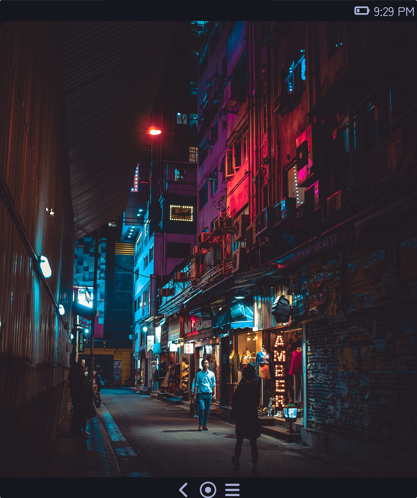

# Genesis Shell

Genesis Shell is the desktop environment and display manager for ExpidusOS. Built using wlroots, libtokyo, and Flutter, it provides a desktop and mobile UI for the operating system.

## Command Line Arguments

| Name                | Type | Description                                                      |
|---------------------|------|------------------------------------------------------------------|
| `--display-manager` | flag | Runs Genesis Shell in a display manager mode by showing a login. |
| `--init-locked`     | flag | Starts Genesis Shell's desktop but locked on startup.            |

## Screenshots

### Desktop

### Mobile

## Web Demo

As Genesis Shell uses Flutter, it can be deployed to the web which has been done to run the [web demo](https://demo.expidusos.com). However, due to the fact being that it uses Flutter, performance may vary between devices and the network connection.
